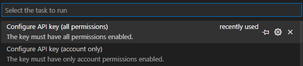
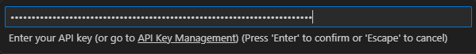

Before you can run the tests, there are a few things you need to do.

- Set up API keys
- Make your keys available to the test suite

Head on over to the [API Key Management](https://account.arena.net/applications) page and create two keys.

1. a key with full permissions
2. a key with 'account' permission only

The account-only key is used to verify some assumptions about what happens when you don't have a permission. For example, you can get an account summary with or without guild information if you have the 'guilds' permission or not.

### User secrets

Next add your keys to the test suite with the user-secrets tool.

Open a terminal inside the Git root directory and type:

```sh
dotnet user-secrets --project GuildWars2.Tests set ApiKeyBasic XXXXXXXX-XXXX-XXXX-XXXX-XXXXXXXXXXXXXXXXXXXX-XXXX-XXXX-XXXX-XXXXXXXXXXXX
dotnet user-secrets --project GuildWars2.Tests set ApiKey YYYYYYYY-YYYY-YYYY-YYYY-YYYYYYYYYYYYYYYYYYYY-YYYY-YYYY-YYYY-YYYYYYYYYYYY
```

Visual Studio Code users can instead use the command palette (Ctrl+Shift+P or Cmd+Shift+P).

\> Tasks: Run Task



Repeat this for both keys.


