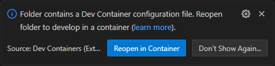

I recommend using the included development container so you don't have to worry about installing dependencies. See [this page](https://code.visualstudio.com/docs/devcontainers/containers) if you are unfamiliar with dev containers. In short, you only need two things:

- [Visual Studio Code](https://code.visualstudio.com/)
  - Install the [Dev Containers](https://marketplace.visualstudio.com/items?itemName=ms-vscode-remote.remote-containers) extension.
- [Docker Desktop](https://www.docker.com/products/docker-desktop)

VSCode will now prompt you to reopen the folder in a container. Click Reopen then go grab a coffee. The initial setup can take a few minutes. (It does not take that long the next time.)

Alternatively you can use the command palette (Ctrl+Shift+P) and do _> Dev Containers: Reopen in Container_.

## Required dependencies

You can ignore this if you use the dev container. Otherwise install the software from the following sections.

- [.NET 8 SDK](https://dotnet.microsoft.com/en-us/download/dotnet/8.0)
- [.NET 6 SDK](https://dotnet.microsoft.com/en-us/download/dotnet/6.0)
- Windows
  - [.NET Framework 4.8.1 Runtime](https://dotnet.microsoft.com/en-us/download/dotnet-framework/net481)
- Mac/Linux
  - [Mono 6.12](https://www.mono-project.com/download/stable/) (Mac/Linux/Windows)
- Visual Studio 2022 (17.7+), Code or Rider

To use Visual Studio 2022 effectively, you also need to install the .NET Framework 4.8 Developer pack. This is not actually required to compile the code, but Visual Studio itself will refuse to load the project without it.

## Optional Windows dependencies

Some features depend on the game client so they can only be tested on Windows.

- [Mumble Client](https://github.com/mumble-voip/mumble/releases)
  - `winget install Mumble.Mumble`
- [Guild Wars 2 Game Client](https://account.arena.net/welcome)

Then start both clients in that order. Restart your game client if it was already running before Mumble, or use a portal/waypoint to a different map.
